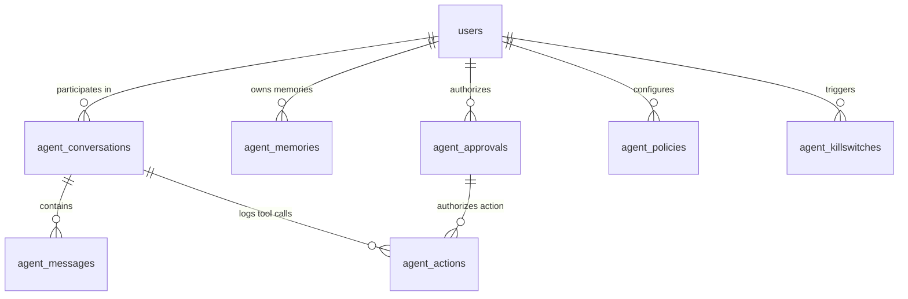

# Agent Governance, Memory & Safety Schema Design (V1)

**Status:** Approved & Finalized  
**Target migration:** `V4__create_agent_schema.sql`  
**Depends on:** `V1__create_identity_schema.sql`  

## 1. Purpose

This document defines the relational and vector database schema for the **Agentic Layer** of the marketplace. It powers role-specific conversational AI agents (Customer Agent, Vendor Agent, Driver Agent) while maintaining strict deterministic safety, human-in-the-loop (HITL) authorization gates, long-term memory with privacy controls, prompt injection auditing, and emergency killswitches.

The design implements the requirements of [`SPEC.md:5, 10.4, 11, 14`](file:///d:/agentcommerce/SPEC.md#L102-L225) and [`TECH_SPEC.md:4, 5.3, 6`](file:///d:/agentcommerce/TECH_SPEC.md):

- **Deterministic Execution Boundary**: The agent orchestration service never writes directly to commerce tables; all mutations execute via authenticated domain APIs.
- **Human-in-the-Loop (HITL) Approvals**: Expiring cryptographic approval tokens (`agent_approvals`) for all consequential actions (placing orders, price updates, substitutions, offer acceptance).
- **Long-Term Vector Memory**: Episodic and semantic agent memory (`agent_memories`) using `pgvector` with user consent controls (view, edit, export, revoke).
- **Multi-Turn Conversations & Messages**: Context tracking, tool call inputs/outputs, and prompt-injection detection flags.
- **Autonomous Delegation Policies**: User-configured boundaries for auto-ordering, auto-accepting driver offers, and price change limits.
- **Immutable Action Audit Log**: Append-only log of every tool execution, input hash, policy check, latency, and outcome.
- **Emergency Safety Killswitches**: Instant operational killswitches at the global, role, tool, or tenant level.

## 2. Scope

### Included in V4

- `agent_conversations` (Multi-turn session state, role context, retention policy)
- `agent_messages` (Message history, tool calls/results, injection detection scores)
- `agent_memories` (Approved facts/preferences with `vector(1536)` RAG embeddings)
- `agent_approvals` (Expiring HITL approval records with financial impact preview)
- `agent_policies` (Autonomous delegation rules and spending limits)
- `agent_actions` (Append-only tool execution audit log and input hashes)
- `agent_killswitches` (Granular emergency disable controls)

## 3. Relationship Model

## 4. Table Definitions

### 4.1 `agent_conversations`

Tracks conversational sessions between authenticated users and role-scoped AI agents.

| Column | Type | Null | Default | Description |
| --- | --- | --- | --- | --- |
| `id` | `UUID` | No | Application generated | Conversation identifier |
| `user_id` | `UUID` | No | — | Authenticated user |
| `agent_role` | `VARCHAR(32)` | No | — | `CUSTOMER_AGENT`, `VENDOR_AGENT`, `DRIVER_AGENT`, `OPERATOR_AGENT` |
| `title` | `VARCHAR(255)` | Yes | — | User-visible conversation title |
| `status` | `VARCHAR(32)` | No | `'ACTIVE'` | `ACTIVE`, `PAUSED`, `ARCHIVED`, `TERMINATED` |
| `retention_days` | `INTEGER` | No | `90` | Conversation data retention window |
| `created_at` | `TIMESTAMPTZ` | No | `now()` | Creation timestamp |
| `updated_at` | `TIMESTAMPTZ` | No | `now()` | Last update timestamp |
| `version` | `BIGINT` | No | `0` | Optimistic concurrency version |

### 4.2 `agent_messages`

Individual messages, tool calls, and prompt injection telemetry.

| Column | Type | Null | Default | Description |
| --- | --- | --- | --- | --- |
| `id` | `UUID` | No | Application generated | Message identifier |
| `conversation_id` | `UUID` | No | — | Parent conversation ID |
| `sender_role` | `VARCHAR(32)` | No | — | `USER`, `AGENT`, `SYSTEM`, `TOOL` |
| `content` | `TEXT` | No | — | Message content |
| `sanitized_content` | `TEXT` | Yes | — | Redacted/sanitized content |
| `prompt_injection_flag` | `BOOLEAN` | No | `FALSE` | Security injection alert flag |
| `prompt_injection_score` | `NUMERIC(4,3)` | Yes | — | Safety model classification score |
| `tool_calls` | `JSONB` | Yes | — | Model-generated tool call requests |
| `tool_results` | `JSONB` | Yes | — | Tool execution response payloads |
| `tokens_used` | `INTEGER` | Yes | — | LLM token consumption |
| `latency_ms` | `INTEGER` | Yes | — | Response generation latency |
| `created_at` | `TIMESTAMPTZ` | No | `now()` | Message timestamp |

### 4.3 `agent_memories`

Long-term user-consented memory with `pgvector` semantic embeddings for RAG retrieval.

| Column | Type | Null | Default | Description |
| --- | --- | --- | --- | --- |
| `id` | `UUID` | No | Application generated | Memory identifier |
| `owner_user_id` | `UUID` | No | — | Owning user |
| `role` | `VARCHAR(32)` | No | — | `CUSTOMER`, `VENDOR`, `DRIVER` |
| `memory_type` | `VARCHAR(32)` | No | — | `PREFERENCE`, `DIETARY`, `BEHAVIOR`, `FACT`, `OPERATIONAL_RULE` |
| `memory_key` | `VARCHAR(120)` | No | — | Indexable memory key |
| `memory_value` | `TEXT` | No | — | Plaintext memory content |
| `embedding` | `vector(1536)` | Yes | — | Semantic embedding vector |
| `confidence_score` | `NUMERIC(4,3)` | No | `1.000` | Extraction confidence |
| `is_user_approved` | `BOOLEAN` | No | `TRUE` | User consent/verification flag |
| `source_conversation_id` | `UUID` | Yes | — | Source conversation |
| `consented_at` | `TIMESTAMPTZ` | No | `now()` | User consent timestamp |
| `revoked_at` | `TIMESTAMPTZ` | Yes | — | Memory deletion/revocation timestamp |
| `created_at` | `TIMESTAMPTZ` | No | `now()` | Creation timestamp |
| `updated_at` | `TIMESTAMPTZ` | No | `now()` | Last update timestamp |
| `version` | `BIGINT` | No | `0` | Optimistic concurrency version |

### 4.4 `agent_approvals`

Expiring Human-in-the-Loop (HITL) step-up confirmation tokens for consequential actions.

| Column | Type | Null | Default | Description |
| --- | --- | --- | --- | --- |
| `id` | `UUID` | No | Application generated | Approval token ID |
| `user_id` | `UUID` | No | — | Approving user |
| `conversation_id` | `UUID` | Yes | — | Context conversation ID |
| `action_type` | `VARCHAR(64)` | No | — | `PLACE_ORDER`, `ACCEPT_SUBSTITUTION`, `REJECT_ORDER`, `BULK_PRICE_CHANGE`, `ACCEPT_DELIVERY_OFFER`, `CANCEL_ORDER`, `ISSUE_REFUND` |
| `action_payload` | `JSONB` | No | — | Exact arguments requiring approval |
| `estimated_financial_impact_minor` | `BIGINT` | Yes | — | Price/fee impact in minor units |
| `currency` | `CHAR(3)` | Yes | `'USD'` | Currency code |
| `status` | `VARCHAR(32)` | No | `'PENDING'` | `PENDING`, `APPROVED`, `REJECTED`, `EXPIRED` |
| `idempotency_key` | `VARCHAR(128)` | No | — | Unique idempotency token |
| `expires_at` | `TIMESTAMPTZ` | No | — | Approval token expiration time |
| `decided_at` | `TIMESTAMPTZ` | Yes | — | Time of human decision |
| `decision_reason` | `VARCHAR(255)` | Yes | — | Explanation or rejection note |
| `created_at` | `TIMESTAMPTZ` | No | `now()` | Creation time |

### 4.5 `agent_policies`

Autonomous delegation boundaries and spending caps.

| Column | Type | Null | Default | Description |
| --- | --- | --- | --- | --- |
| `id` | `UUID` | No | Application generated | Policy ID |
| `user_id` | `UUID` | No | — | User setting policy |
| `agent_role` | `VARCHAR(32)` | No | — | `CUSTOMER_AGENT`, `VENDOR_AGENT`, `DRIVER_AGENT` |
| `policy_type` | `VARCHAR(64)` | No | — | `AUTO_ORDER`, `AUTO_ACCEPT_OFFER`, `AUTO_SUBSTITUTION`, `PRICE_CHANGE_LIMIT` |
| `policy_rules` | `JSONB` | No | `'{}'::jsonb` | Policy rule parameters |
| `max_auto_amount_minor` | `BIGINT` | Yes | — | Max monetary limit without confirmation |
| `is_enabled` | `BOOLEAN` | No | `FALSE` | Policy activation switch |
| `created_at` | `TIMESTAMPTZ` | No | `now()` | Creation time |
| `updated_at` | `TIMESTAMPTZ` | No | `now()` | Last update time |
| `version` | `BIGINT` | No | `0` | Optimistic concurrency version |

### 4.6 `agent_actions`

Append-only immutable audit log of all agent tool executions and policy checks.

| Column | Type | Null | Default | Description |
| --- | --- | --- | --- | --- |
| `id` | `UUID` | No | Application generated | Action audit ID |
| `user_id` | `UUID` | No | — | Acting user |
| `conversation_id` | `UUID` | Yes | — | Conversation context |
| `approval_id` | `UUID` | Yes | — | Linked approval record ID |
| `tool_name` | `VARCHAR(120)` | No | — | Executed tool name |
| `input_hash` | `VARCHAR(64)` | No | — | SHA-256 hash of raw inputs |
| `sanitized_inputs` | `JSONB` | Yes | — | Redacted tool input payload |
| `output_summary` | `JSONB` | Yes | — | Tool execution output summary |
| `status` | `VARCHAR(32)` | No | — | `SUCCESS`, `FAILED`, `BLOCKED_BY_POLICY`, `REQUIRES_APPROVAL` |
| `policy_check_passed` | `BOOLEAN` | No | `TRUE` | Server policy enforcement result |
| `duration_ms` | `INTEGER` | No | — | Tool execution latency |
| `error_message` | `TEXT` | Yes | — | Failure error message |
| `correlation_id` | `VARCHAR(128)` | Yes | — | Distributed trace ID |
| `created_at` | `TIMESTAMPTZ` | No | `now()` | Log timestamp |

### 4.7 `agent_killswitches`

Emergency circuit breaker switches to disable compromised or malfunctioning agents/tools.

| Column | Type | Null | Default | Description |
| --- | --- | --- | --- | --- |
| `id` | `UUID` | No | Application generated | Killswitch ID |
| `target_type` | `VARCHAR(32)` | No | — | `GLOBAL`, `AGENT_ROLE`, `TOOL`, `TENANT`, `USER` |
| `target_identifier` | `VARCHAR(120)` | No | — | Target name (e.g. `place_order` or `CUSTOMER_AGENT`) |
| `is_disabled` | `BOOLEAN` | No | `TRUE` | Disable state |
| `reason` | `VARCHAR(255)` | No | — | Reason for emergency disable |
| `triggered_by_user_id` | `UUID` | No | — | Administrator or system trigger |
| `created_at` | `TIMESTAMPTZ` | No | `now()` | Activation time |
| `resolved_at` | `TIMESTAMPTZ` | Yes | — | Resolution timestamp |

## 5. Summary Checklist

- [x] Multi-turn agent conversation and message history defined.
- [x] Long-term episodic memory with `vector(1536)` RAG embeddings and consent revocation.
- [x] Expiring HITL approval records with financial impact verification.
- [x] Autonomous delegation limits and spending policies.
- [x] Immutable tool execution audit log with SHA-256 input hashing.
- [x] Granular emergency killswitches.
