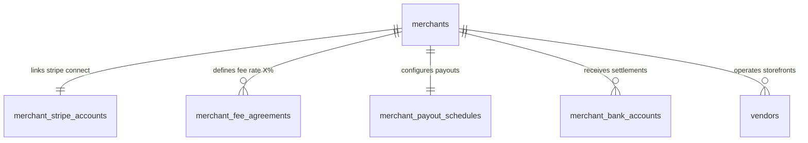

# Merchant Financial & Legal Schema Design (V1)

**Status:** Approved & Finalized  
**Target migration:** `V3__create_merchant_schema.sql`  
**Depends on:** `V1__create_identity_schema.sql`, `V2__create_vendor_schema.sql`  

## 1. Purpose

This document defines the relational database schema for merchant legal entities, business tax registration, Stripe Connect payout account integration, commission & platform fee agreements (`X%`), payout schedules, and bank account metadata across the Agentic Community Delivery Marketplace.

While `VENDOR_SCHEMA_DESIGN_V3.md` models physical storefront locations, pickup instructions, and kitchen operations, this **Merchant Schema** models the legal business entity, financial settlement, tax compliance (1099-K), and Stripe Connect payment routing.

The design supports industry standards (DoorDash Merchant, Uber Eats Enterprise, Square, Stripe Connect):

- **Merchant Organizations**: Legal entity name, tax classification (`LLC`, `CORPORATION`, `SOLE_PROPRIETORSHIP`), DBA name, encrypted tax ID hashes (EIN/SSN).
- **Stripe Connect Integration**: `stripe_connect_account_id` (`acct_...`), payout capabilities, charge capabilities, onboarding status.
- **Commission & Platform Fee Agreements (`X%`)**: Effective dates, basis point commission rate (`commission_rate_bps`), flat transaction fees (`flat_fee_minor`), and fee tier overrides.
- **Payout Schedules**: Automated daily/weekly settlement rules and payout thresholds.
- **Settlement Bank Metadata**: Masked routing and account numbers for merchant reporting and verification.

## 2. Scope

### Included in Merchant Schema

- `merchants` (Legal business entity, business structure, DBA name, tax verification status)
- `merchant_stripe_accounts` (Stripe Connect account mapping, payout capability flags, onboarding status)
- `merchant_fee_agreements` (Platform fee `X%` basis points, fixed per-order fee, effective interval)
- `merchant_payout_schedules` (Settlement frequency, payout delay days, minimum payout threshold)
- `merchant_bank_accounts` (Masked settlement bank routing/account metadata)

## 3. Relationship Model

## 4. Table Definitions

### 4.1 `merchants`

Represents the merchant legal business entity for contracts, settlement, and tax reporting.

| Column | Type | Null | Default | Description |
| --- | --- | --- | --- | --- |
| `id` | `UUID` | No | Application generated | Stable merchant identifier |
| `legal_entity_name` | `VARCHAR(255)` | No | — | Registered corporate or legal name |
| `dba_name` | `VARCHAR(255)` | No | — | Doing Business As (DBA) trade name |
| `business_type` | `VARCHAR(64)` | No | `'LLC'` | `LLC`, `CORPORATION`, `SOLE_PROPRIETORSHIP`, `PARTNERSHIP`, `INDIVIDUAL` |
| `tax_id_last_four` | `VARCHAR(4)` | Yes | — | Masked EIN/SSN for 1099-K verification |
| `country_code` | `CHAR(2)` | No | `'US'` | Country of legal registration |
| `support_email` | `VARCHAR(320)` | No | — | Merchant administrative contact email |
| `support_phone` | `VARCHAR(32)` | No | — | Merchant administrative contact phone |
| `status` | `VARCHAR(32)` | No | `'DRAFT'` | `DRAFT`, `PENDING_VERIFICATION`, `VERIFIED`, `SUSPENDED`, `CLOSED` |
| `created_at` | `TIMESTAMPTZ` | No | `now()` | Creation time |
| `updated_at` | `TIMESTAMPTZ` | No | `now()` | Last update time |
| `version` | `BIGINT` | No | `0` | Optimistic concurrency version |

### 4.2 `merchant_stripe_accounts`

Connects the merchant entity to a Stripe Connect custom/express account.

| Column | Type | Null | Default | Description |
| --- | --- | --- | --- | --- |
| `merchant_id` | `UUID` | No | — | Primary & Foreign key to `merchants.id` |
| `stripe_connect_account_id` | `VARCHAR(255)` | No | — | Stripe Connect account identifier (`acct_...`) |
| `payouts_enabled` | `BOOLEAN` | No | `FALSE` | Stripe payouts capability flag |
| `charges_enabled` | `BOOLEAN` | No | `FALSE` | Stripe charges capability flag |
| `details_submitted` | `BOOLEAN` | No | `FALSE` | Stripe onboarding completion flag |
| `default_currency` | `CHAR(3)` | No | `'USD'` | Settlement currency |
| `onboarding_status` | `VARCHAR(32)` | No | `'NOT_STARTED'` | `NOT_STARTED`, `IN_PROGRESS`, `COMPLETED`, `ACTION_REQUIRED` |
| `created_at` | `TIMESTAMPTZ` | No | `now()` | Creation time |
| `updated_at` | `TIMESTAMPTZ` | No | `now()` | Last update time |

### 4.3 `merchant_fee_agreements`

Stores the effective platform commission rate `X%` and fixed order fees for every merchant.

| Column | Type | Null | Default | Description |
| --- | --- | --- | --- | --- |
| `id` | `UUID` | No | Application generated | Agreement identifier |
| `merchant_id` | `UUID` | No | — | Owning merchant ID |
| `commission_rate_bps` | `INTEGER` | No | `1500` | Platform fee `X%` in basis points (1500 = 15.00%) |
| `flat_fee_minor` | `BIGINT` | No | `30` | Fixed per-order platform fee in minor units ($0.30) |
| `effective_from` | `TIMESTAMPTZ` | No | `now()` | Agreement start timestamp |
| `effective_to` | `TIMESTAMPTZ` | Yes | — | Agreement expiration timestamp (NULL = perpetual) |
| `status` | `VARCHAR(32)` | No | `'ACTIVE'` | `ACTIVE`, `SUPERSEDED`, `PENDING` |
| `created_at` | `TIMESTAMPTZ` | No | `now()` | Creation time |
| `updated_at` | `TIMESTAMPTZ` | No | `now()` | Last update time |

### 4.4 `merchant_payout_schedules`

Rules governing daily/weekly money movement transfers.

| Column | Type | Null | Default | Description |
| --- | --- | --- | --- | --- |
| `merchant_id` | `UUID` | No | — | Primary & Foreign key to `merchants.id` |
| `interval_type` | `VARCHAR(32)` | No | `'DAILY'` | Settlement frequency (`DAILY`, `WEEKLY`, `MONTHLY`, `MANUAL`) |
| `weekly_anchor_day` | `SMALLINT` | Yes | — | ISO day of week for weekly payouts (1 = Mon ... 7 = Sun) |
| `monthly_anchor_day` | `SMALLINT` | Yes | — | Day of month for monthly payouts (1..31) |
| `delay_days` | `INTEGER` | No | `2` | Rolling settlement delay buffer in days |
| `minimum_payout_minor` | `BIGINT` | No | `1000` | Minimum payout threshold ($10.00) |
| `created_at` | `TIMESTAMPTZ` | No | `now()` | Creation time |
| `updated_at` | `TIMESTAMPTZ` | No | `now()` | Last update time |

### 4.5 `merchant_bank_accounts`

Masked bank account details for merchant settlement reporting.

| Column | Type | Null | Default | Description |
| --- | --- | --- | --- | --- |
| `id` | `UUID` | No | Application generated | Bank account record ID |
| `merchant_id` | `UUID` | No | — | Owning merchant ID |
| `bank_name` | `VARCHAR(120)` | No | — | Bank institution name |
| `routing_number_last_four` | `VARCHAR(4)` | No | — | Masked routing number |
| `account_number_last_four` | `VARCHAR(4)` | No | — | Masked account number |
| `currency` | `CHAR(3)` | No | `'USD'` | Account currency |
| `is_default` | `BOOLEAN` | No | `TRUE` | Default settlement account flag |
| `created_at` | `TIMESTAMPTZ` | No | `now()` | Creation time |

## 5. Summary Checklist

- [x] Merchant legal entity structure defined.
- [x] Stripe Connect integration mapping (`stripe_connect_account_id`).
- [x] Commission fee agreement model storing `commission_rate_bps` for `X%`.
- [x] Payout schedule rules (daily/weekly settlement delays).
- [x] Masked settlement bank account metadata.
