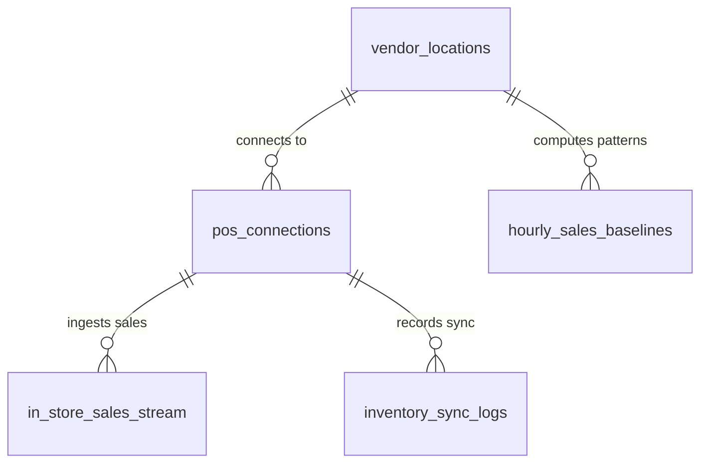

# POS Integration & In-Store Sales Intelligence Schema Design (V1)

**Status:** Approved & Finalized  
**Target migration:** `V6__create_pos_integration_schema.sql`  
**Depends on:** `V1` to `V5`  

## 1. Purpose

This document defines the architecture and relational database schema for **Point-of-Sale (POS) Integrations, Real-Time In-Store Sales Ingestion, Automated Bi-Directional Inventory Syncing, and AI Sales Trend Analysis**.

This enables the platform to sell its killer feature to merchants:
1. **Automated Inventory Synchronization**: When an item is purchased at the physical store register, the marketplace available inventory decrements within seconds to prevent overselling.
2. **In-Store Sales Ingestion**: Tracks physical walk-in sales volume by hour/day to detect slow periods and automatically recommend targeted flash promotions.
3. **1-Click POS Onboarding**: Supports OAuth connections for market leaders (Square, Clover, Toast) and universal aggregators (Deliverect, Omnivore, ItsaCheckmate) alongside manual CSV/QR scan bridges.

## 2. Scope

### Included in V6

- `pos_connections` (Vendor store mapping, provider selection, encrypted OAuth credentials, webhook subscription IDs, sync status)
- `in_store_sales_stream` (Granular transaction stream of physical in-store sales events)
- `inventory_sync_logs` (Bi-directional inventory sync audit trail between POS and marketplace)
- `hourly_sales_baselines` (Aggregated historical sales trends by hour of day, day of week, and seasonality)

## 3. Relationship Model

## 4. Table Definitions

### 4.1 `pos_connections`

Stores active POS integration credentials and webhook subscriptions per store location.

| Column | Type | Null | Default | Description |
| --- | --- | --- | --- | --- |
| `id` | `UUID` | No | Application generated | Connection ID |
| `vendor_location_id` | `UUID` | No | — | Owning location ID |
| `provider` | `VARCHAR(64)` | No | — | `SQUARE`, `CLOVER`, `TOAST`, `LIGHTSPEED`, `DELIVERECT`, `OMNIVORE`, `CUSTOM_WEBHOOK`, `MANUAL_BRIDGE` |
| `external_merchant_id` | `VARCHAR(255)` | Yes | — | Merchant ID in external POS system |
| `external_location_id` | `VARCHAR(255)` | Yes | — | Location ID in external POS system |
| `oauth_access_token_encrypted` | `TEXT` | Yes | — | Encrypted OAuth access token |
| `oauth_refresh_token_encrypted` | `TEXT` | Yes | — | Encrypted OAuth refresh token |
| `token_expires_at` | `TIMESTAMPTZ` | Yes | — | Token expiry |
| `webhook_secret_encrypted` | `TEXT` | Yes | — | Webhook validation signing secret |
| `is_catalog_sync_enabled` | `BOOLEAN` | No | `TRUE` | Auto-import in-store menu/catalog |
| `is_inventory_sync_enabled` | `BOOLEAN` | No | `TRUE` | Auto-sync stock counts on physical sales |
| `is_sales_sync_enabled` | `BOOLEAN` | No | `TRUE` | Ingest real-time sales for slow-period AI |
| `last_sync_at` | `TIMESTAMPTZ` | Yes | — | Last sync timestamp |
| `status` | `VARCHAR(32)` | No | `'DISCONNECTED'` | `CONNECTED`, `PENDING_AUTH`, `ERROR`, `DISCONNECTED` |
| `created_at` | `TIMESTAMPTZ` | No | `now()` | Creation time |
| `updated_at` | `TIMESTAMPTZ` | No | `now()` | Last update time |
| `version` | `BIGINT` | No | `0` | Optimistic concurrency version |

### 4.2 `in_store_sales_stream`

Immutable stream of in-store physical register transactions.

| Column | Type | Null | Default | Description |
| --- | --- | --- | --- | --- |
| `id` | `UUID` | No | Application generated | Record ID |
| `vendor_location_id` | `UUID` | No | — | Location ID |
| `pos_connection_id` | `UUID` | Yes | — | Linked POS connection |
| `external_transaction_id` | `VARCHAR(255)` | Yes | — | POS transaction / ticket ID |
| `gross_amount_minor` | `BIGINT` | No | — | Total transaction amount |
| `net_amount_minor` | `BIGINT` | No | — | Net transaction amount (excluding tax/tips) |
| `currency` | `CHAR(3)` | No | `'USD'` | Transaction currency |
| `item_count` | `INTEGER` | No | `1` | Total items in ticket |
| `items_breakdown` | `JSONB` | Yes | `'[]'::jsonb` | Item SKUs, names, quantities, and prices |
| `transaction_timestamp` | `TIMESTAMPTZ` | No | — | Time transaction occurred at register |
| `created_at` | `TIMESTAMPTZ` | No | `now()` | Ingestion timestamp |

### 4.3 `inventory_sync_logs`

Audit record of inventory level changes triggered by in-store register purchases or restocks.

| Column | Type | Null | Default | Description |
| --- | --- | --- | --- | --- |
| `id` | `UUID` | No | Application generated | Log ID |
| `vendor_location_id` | `UUID` | No | — | Location ID |
| `sku` | `VARCHAR(120)` | No | — | Affected item SKU |
| `change_source` | `VARCHAR(32)` | No | — | `IN_STORE_POS_SALE`, `IN_STORE_RESTOCK`, `ONLINE_ORDER`, `MANUAL_OVERRIDE` |
| `previous_quantity` | `INTEGER` | No | — | Quantity before event |
| `quantity_delta` | `INTEGER` | No | — | Change (+ or -) |
| `new_quantity` | `INTEGER` | No | — | Quantity after event |
| `created_at` | `TIMESTAMPTZ` | No | `now()` | Log timestamp |

### 4.4 `hourly_sales_baselines`

Pre-aggregated statistical baselines per store location to detect slow hours.

| Column | Type | Null | Default | Description |
| --- | --- | --- | --- | --- |
| `id` | `UUID` | No | Application generated | Baseline ID |
| `vendor_location_id` | `UUID` | No | — | Location ID |
| `day_of_week` | `SMALLINT` | No | — | ISO Day of week (1 = Monday ... 7 = Sunday) |
| `hour_of_day` | `SMALLINT` | No | — | Hour (0..23) |
| `average_hourly_revenue_minor` | `BIGINT` | No | `0` | 30-day historical mean revenue |
| `p25_revenue_minor` | `BIGINT` | No | `0` | 25th percentile (slow threshold) |
| `p75_revenue_minor` | `BIGINT` | No | `0` | 75th percentile (rush threshold) |
| `last_recalculated_at` | `TIMESTAMPTZ` | No | `now()` | Calculation timestamp |

## 5. Summary Checklist

- [x] Multi-provider POS connection model (Square, Clover, Toast, Deliverect, Omnivore).
- [x] Real-time in-store sales stream for revenue deficit analysis.
- [x] Bi-directional inventory sync logging.
- [x] Statistical hourly sales baseline model for automated slow-period detection.
