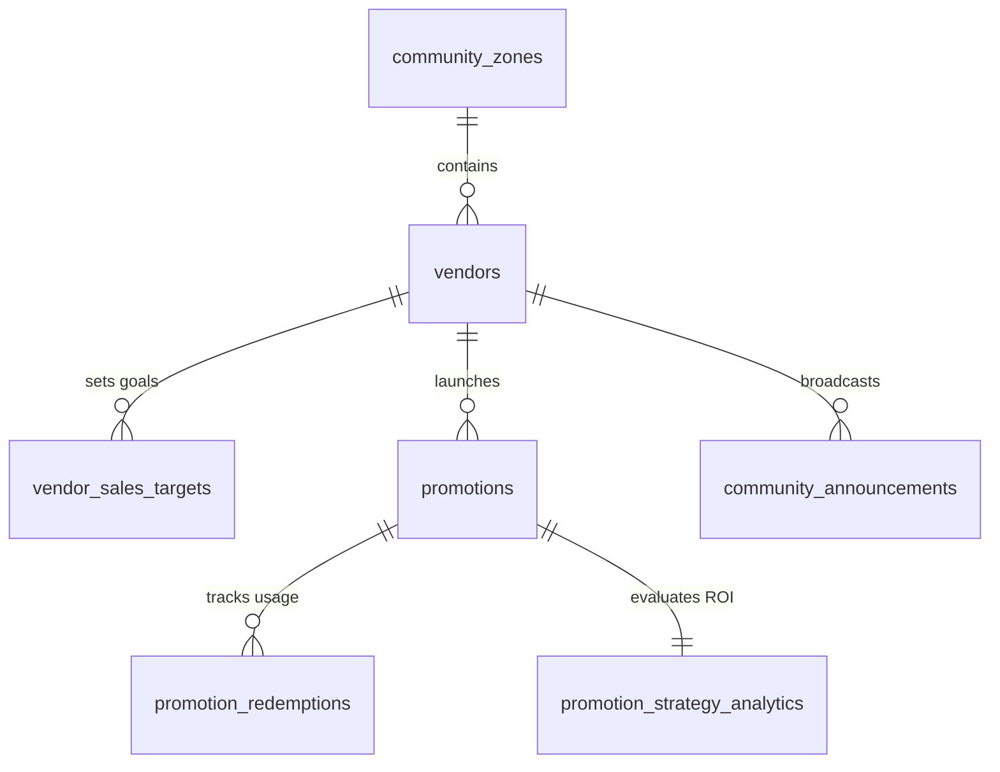

# Hyperlocal Community Promotions & Sales Strategy Schema Design (V1)

**Status:** Approved & Finalized  
**Target migration:** `V5__create_promotions_and_community_schema.sql`  
**Depends on:** `V1` (Users), `V2` (Vendors), `V3` (Merchants), `V4` (Agents)  

## 1. Purpose

This document defines the relational database schema for **Hyperlocal Community Discovery, In-Store & Online Flash Promotions, Vendor Daily Sales Goals, and Real-Time Strategy Performance Attribution**.

This enables merchants to:
- Set daily/hourly revenue targets (e.g., target `$3,000` today).
- Detect sales deficits during slow hours (e.g., 8:00 PM – 11:00 PM).
- Trigger targeted in-store and online promotions (e.g., *10% off from 8:00 PM to 10:30 PM*) broadcast to neighbors within a 1–2 mile radius.
- Support both **Online Delivery Checkout** and **In-Store Walk-In QR Code Redemptions**.
- Attribute and measure **Incremental Lift vs Historical Baseline** to see if the strategy worked.
- Store winning strategies in Agent Memory so the Vendor Agent can proactively recommend them on future slow days.

## 2. Scope

### Included in V5

- `community_zones` (Geofenced neighborhood districts with PostGIS polygons)
- `vendor_sales_targets` (Daily/hourly merchant revenue goals and sales deficit tracking)
- `promotions` (Hyperlocal flash deals, discount types, in-store QR passes, online delivery flags, schedule)
- `promotion_redemptions` (Tracking in-store POS scans vs online delivery redemptions)
- `promotion_strategy_analytics` (Baseline sales vs actual promotion revenue, incremental lift, goal achievement metrics)
- `community_announcements` (Non-discount community updates, events, and neighborhood notices)

## 3. Relationship Model

## 4. Table Definitions

### 4.1 `community_zones`

Geofenced neighborhood zones (e.g. "Downtown Arts District", "Westside Village").

| Column | Type | Null | Default | Description |
| --- | --- | --- | --- | --- |
| `id` | `UUID` | No | Application generated | Zone identifier |
| `name` | `VARCHAR(120)` | No | — | Community name |
| `slug` | `VARCHAR(120)` | No | — | URL identifier |
| `city` | `VARCHAR(120)` | No | — | Municipality |
| `boundary` | `GEOGRAPHY(MULTIPOLYGON, 4326)` | No | — | Spatial district polygon |
| `is_active` | `BOOLEAN` | No | `TRUE` | Zone status |
| `created_at` | `TIMESTAMPTZ` | No | `now()` | Creation time |

### 4.2 `vendor_sales_targets`

Daily or period revenue targets set by the merchant or suggested by AI.

| Column | Type | Null | Default | Description |
| --- | --- | --- | --- | --- |
| `id` | `UUID` | No | Application generated | Target record ID |
| `vendor_location_id` | `UUID` | No | — | Location ID |
| `target_date` | `DATE` | No | — | Goal date |
| `target_revenue_minor` | `BIGINT` | No | — | Daily goal (e.g. $3,000 = 300,000 minor units) |
| `current_actual_revenue_minor` | `BIGINT` | No | `0` | Live cumulative revenue |
| `projected_deficit_minor` | `BIGINT` | No | `0` | Projected shortfall |
| `status` | `VARCHAR(32)` | No | `'IN_PROGRESS'` | `IN_PROGRESS`, `ACHIEVED`, `MISSED` |
| `created_at` | `TIMESTAMPTZ` | No | `now()` | Creation time |
| `updated_at` | `TIMESTAMPTZ` | No | `now()` | Last update time |

### 4.3 `promotions`

Dynamic flash deals and strategy-driven community offers.

| Column | Type | Null | Default | Description |
| --- | --- | --- | --- | --- |
| `id` | `UUID` | No | Application generated | Promotion ID |
| `vendor_location_id` | `UUID` | No | — | Issuing location |
| `title` | `VARCHAR(255)` | No | — | Headline (e.g. "Late Night 10% Flash Sale") |
| `description` | `TEXT` | Yes | — | Offer details & terms |
| `strategy_type` | `VARCHAR(64)` | No | `'SLOW_PERIOD_BOOST'` | `SLOW_PERIOD_BOOST`, `EXCESS_INVENTORY`, `NEW_CUSTOMER_ACQUISITION`, `HAPPY_HOUR` |
| `discount_type` | `VARCHAR(32)` | No | `'PERCENTAGE'` | `PERCENTAGE`, `FIXED_AMOUNT`, `FREE_ITEM`, `BOGO` |
| `discount_value` | `NUMERIC(6,2)` | No | — | Value (e.g. `10.00` for 10% or `$5.00`) |
| `minimum_order_minor` | `BIGINT` | No | `0` | Minimum purchase required |
| `is_online_delivery_enabled` | `BOOLEAN` | No | `TRUE` | Applies to delivery orders |
| `is_in_store_enabled` | `BOOLEAN` | No | `TRUE` | Applies to walk-in in-store customers |
| `in_store_qr_code` | `VARCHAR(128)` | Yes | — | Unique scan token for walk-in POS redemption |
| `target_radius_meters` | `INTEGER` | No | `3000` | Broadcast distance to local neighbors (e.g. 3km / ~2 miles) |
| `starts_at` | `TIMESTAMPTZ` | No | — | Offer start time (e.g. 8:00 PM) |
| `ends_at` | `TIMESTAMPTZ` | No | — | Offer expiration (e.g. 10:30 PM) |
| `max_redemptions` | `INTEGER` | Yes | — | Maximum coupon cap |
| `total_redemptions` | `INTEGER` | No | `0` | Current claim count |
| `status` | `VARCHAR(32)` | No | `'SCHEDULED'` | `SCHEDULED`, `ACTIVE`, `EXPIRED`, `CANCELLED` |
| `created_at` | `TIMESTAMPTZ` | No | `now()` | Creation time |
| `updated_at` | `TIMESTAMPTZ` | No | `now()` | Last update time |
| `version` | `BIGINT` | No | `0` | Optimistic concurrency version |

### 4.4 `promotion_redemptions`

Individual customer redemption log for in-store and online claims.

| Column | Type | Null | Default | Description |
| --- | --- | --- | --- | --- |
| `id` | `UUID` | No | Application generated | Redemption ID |
| `promotion_id` | `UUID` | No | — | Linked promotion ID |
| `user_id` | `UUID` | No | — | Redeeming customer ID |
| `channel` | `VARCHAR(32)` | No | — | `ONLINE_DELIVERY`, `IN_STORE_QR` |
| `order_id` | `UUID` | Yes | — | Linked delivery order ID (if online) |
| `discount_amount_minor` | `BIGINT` | No | — | Exact discount given |
| `gross_order_amount_minor` | `BIGINT` | No | — | Order total before discount |
| `redeemed_at` | `TIMESTAMPTZ` | No | `now()` | Redemption timestamp |

### 4.5 `promotion_strategy_analytics`

Measures strategy effectiveness, baseline comparison, incremental sales lift, and ROI.

| Column | Type | Null | Default | Description |
| --- | --- | --- | --- | --- |
| `promotion_id` | `UUID` | PRIMARY KEY | — | Linked promotion ID |
| `baseline_sales_minor` | `BIGINT` | No | — | Historical normal revenue during this time window |
| `actual_promo_sales_minor` | `BIGINT` | No | `0` | Total revenue generated during promotion |
| `incremental_lift_minor` | `BIGINT` | No | `0` | `actual_promo_sales - baseline_sales` |
| `total_discount_cost_minor` | `BIGINT` | No | `0` | Total margin discount given |
| `net_incremental_profit_minor` | `BIGINT` | No | `0` | `incremental_lift - total_discount_cost` |
| `new_customers_acquired` | `INTEGER` | No | `0` | First-time buyers count |
| `daily_goal_achieved` | `BOOLEAN` | No | `FALSE` | Whether daily sales target was achieved |
| `strategy_rating` | `VARCHAR(32)` | Yes | — | `HIGH_PERFORMING`, `MODERATE`, `UNDERPERFORMING` |
| `calculated_at` | `TIMESTAMPTZ` | No | `now()` | Analytics calculation time |

### 4.6 `community_announcements`

Community notices, chef specials, and merchant announcements.

| Column | Type | Null | Default | Description |
| --- | --- | --- | --- | --- |
| `id` | `UUID` | No | Application generated | Announcement ID |
| `vendor_location_id` | `UUID` | No | — | Issuing location |
| `title` | `VARCHAR(255)` | No | — | Title |
| `content` | `TEXT` | No | — | Announcement message |
| `image_url` | `VARCHAR(512)` | Yes | — | Banner image |
| `channel` | `VARCHAR(32)` | No | `'FEED'` | `FEED`, `PUSH_NOTIFICATION`, `ALL` |
| `target_radius_meters` | `INTEGER` | No | `3000` | Broadcast radius |
| `published_at` | `TIMESTAMPTZ` | No | `now()` | Publication timestamp |
| `expires_at` | `TIMESTAMPTZ` | Yes | — | Expiration timestamp |

## 5. Summary Checklist

- [x] Neighborhood community district polygons with PostGIS support.
- [x] Daily revenue target tracking with deficit detection.
- [x] Dual in-store QR code & online delivery flash promotion engine.
- [x] Hyperlocal radius-based broadcast filter (e.g. 1-2 miles).
- [x] Historical baseline vs actual lift ROI attribution.
- [x] Closed-loop feedback enabling AI agents to learn winning strategies.
