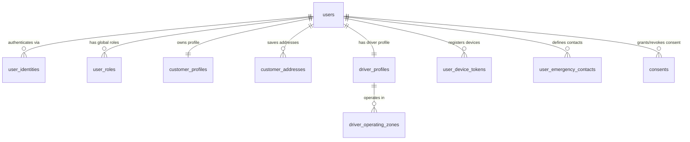

# User & Identity Schema Design (V1)

**Status:** Approved & Finalized  
**Target migration:** Extension to `V1__create_identity_schema.sql` / User Domain  
**Depends on:** `V1__create_identity_schema.sql`  

## 1. Purpose

This document defines the relational database schema for users, customer profiles, saved delivery addresses, driver vehicle & operating profiles, push notification device tokens, emergency contacts, and privacy consents across the Agentic Community Delivery Marketplace.

The design supports industry standards (DoorDash, Uber Eats, Lyft, Stripe Identity):

- Authentication identity linking (OIDC, OAuth2, Email/Phone).
- Global user role assignment (`CUSTOMER`, `VENDOR_MEMBER`, `DRIVER`, `OPERATOR`).
- **Customer Profiles**: Dietary preferences, allergen flags, substitution modes (`PREFERENCE_BASED`, `APPROVAL_REQUIRED`), auto-order spend limits, default tip rules.
- **Saved Customer Delivery Addresses**: Geocoded PostGIS point coordinates, gate codes, building names, delivery instructions, and default address flags.
- **Driver Profiles & Vehicle Data**: Onboarding verification state, vehicle classification (`CAR`, `BICYCLE`, `SCOOTER`, `FOOT`), license plate, make/model/color, background check status, online/offline availability, and rating aggregates.
- **Driver Operating Zones**: Spatial multi-polygons (`GEOGRAPHY(MULTIPOLYGON, 4326)`) defining driver preferred coverage areas.
- **Device Push Notification Tokens**: iOS/Android/Web push tokens (`FCM`/`APNS`).
- **Emergency Safety Contacts**: Driver and customer emergency contact records.
- **Privacy & Consent Logs**: Audit trail for location tracking and agent personalization consent.

## 2. Scope

### Included in User Schema

- `users` (Core account entity, status, profile image URL)
- `user_identities` (Auth provider credentials and OAuth sub/issuer)
- `user_roles` (Global platform permissions)
- `customer_profiles` (Dietary preferences, allergen JSONB, substitution policy, auto-order max limit)
- `customer_addresses` (Saved delivery destinations, PostGIS coordinates, gate codes, building names, instructions)
- `driver_profiles` (Vehicle details, license numbers, background check, online status, driver rating)
- `driver_operating_zones` (Driver service boundaries)
- `user_device_tokens` (Push notification tokens and device metadata)
- `user_emergency_contacts` (Safety contacts)
- `consents` (Location & agent personalization consent logs)

## 3. Relationship Model

## 4. Table Definitions

### 4.1 `users`

Core platform user account.

| Column | Type | Null | Default | Description |
| --- | --- | --- | --- | --- |
| `id` | `UUID` | No | Application generated | Stable user identifier |
| `email` | `VARCHAR(320)` | Yes | — | Primary email address |
| `phone` | `VARCHAR(32)` | Yes | — | Primary E.164 phone number |
| `profile_image_url` | `VARCHAR(512)` | Yes | — | User avatar URL |
| `status` | `VARCHAR(32)` | No | `'ACTIVE'` | Account state (`ACTIVE`, `SUSPENDED`, `DELETED`) |
| `created_at` | `TIMESTAMPTZ` | No | `now()` | Creation timestamp |
| `updated_at` | `TIMESTAMPTZ` | No | `now()` | Last update timestamp |
| `version` | `BIGINT` | No | `0` | Optimistic concurrency version |

### 4.2 `customer_profiles`

Customer preferences, dietary restrictions, and AI agent execution policies.

| Column | Type | Null | Default | Description |
| --- | --- | --- | --- | --- |
| `user_id` | `UUID` | No | — | Primary & Foreign Key to `users.id` |
| `display_name` | `VARCHAR(255)` | No | — | Customer preferred display name |
| `locale` | `VARCHAR(32)` | No | `'en-US'` | Language & locale code |
| `timezone` | `VARCHAR(64)` | No | `'UTC'` | Preferred timezone |
| `dietary_restrictions` | `JSONB` | Yes | `'[]'::jsonb` | Dietary restrictions (e.g. `["VEGAN", "GLUTEN_FREE"]`) |
| `allergens` | `JSONB` | Yes | `'[]'::jsonb` | Allergen alerts (e.g. `["PEANUTS", "SHELLFISH"]`) |
| `substitution_mode` | `VARCHAR(32)` | No | `'APPROVAL_REQUIRED'` | `PREFERENCE_BASED`, `APPROVAL_REQUIRED` |
| `auto_order_enabled` | `BOOLEAN` | No | `FALSE` | Auto-order agent capability toggle |
| `auto_order_max_amount_minor` | `BIGINT` | Yes | `0` | Max order amount allowed for auto-order |
| `default_tip_percentage` | `NUMERIC(4,2)` | No | `15.00` | Default driver tip percentage |
| `created_at` | `TIMESTAMPTZ` | No | `now()` | Creation time |
| `updated_at` | `TIMESTAMPTZ` | No | `now()` | Last update time |
| `version` | `BIGINT` | No | `0` | Optimistic concurrency version |

### 4.3 `customer_addresses`

Saved delivery addresses with PostGIS spatial coordinates and handoff instructions.

| Column | Type | Null | Default | Description |
| --- | --- | --- | --- | --- |
| `id` | `UUID` | No | Application generated | Address identifier |
| `user_id` | `UUID` | No | — | Owning user ID |
| `label` | `VARCHAR(64)` | No | `'HOME'` | Address label (`HOME`, `WORK`, `OTHER`) |
| `address_line_1` | `VARCHAR(255)` | No | — | Street address |
| `address_line_2` | `VARCHAR(255)` | Yes | — | Apartment/suite number |
| `building_name` | `VARCHAR(120)` | Yes | — | Building/complex name |
| `gate_code` | `VARCHAR(32)` | Yes | — | Entry/gate code |
| `locality` | `VARCHAR(120)` | No | — | City |
| `administrative_area` | `VARCHAR(120)` | No | — | State/province |
| `postal_code` | `VARCHAR(32)` | No | — | Postal code |
| `country_code` | `CHAR(2)` | No | `'US'` | Country code |
| `formatted_address` | `VARCHAR(512)` | No | — | Provider-normalized display address |
| `coordinates` | `GEOGRAPHY(POINT, 4326)` | No | — | Geocoded PostGIS point (lon/lat) |
| `delivery_instructions` | `TEXT` | Yes | — | Drop-off instructions (e.g. "Leave at front porch") |
| `is_default` | `BOOLEAN` | No | `FALSE` | Default delivery address flag |
| `created_at` | `TIMESTAMPTZ` | No | `now()` | Creation time |
| `updated_at` | `TIMESTAMPTZ` | No | `now()` | Last update time |

### 4.4 `driver_profiles`

Driver onboarding, vehicle details, availability status, and rating metrics.

| Column | Type | Null | Default | Description |
| --- | --- | --- | --- | --- |
| `user_id` | `UUID` | No | — | Primary & Foreign Key to `users.id` |
| `status` | `VARCHAR(32)` | No | `'PENDING_VERIFICATION'` | `PENDING_VERIFICATION`, `ACTIVE`, `SUSPENDED` |
| `vehicle_type` | `VARCHAR(32)` | No | `'CAR'` | Vehicle classification (`CAR`, `BICYCLE`, `SCOOTER`, `FOOT`) |
| `vehicle_make` | `VARCHAR(64)` | Yes | — | Vehicle make (e.g. Toyota) |
| `vehicle_model` | `VARCHAR(64)` | Yes | — | Vehicle model (e.g. Camry) |
| `vehicle_color` | `VARCHAR(32)` | Yes | — | Vehicle color (e.g. Silver) |
| `license_plate` | `VARCHAR(32)` | Yes | — | License plate number |
| `license_number` | `VARCHAR(64)` | Yes | — | Driver's license number |
| `background_check_status` | `VARCHAR(32)` | No | `'PENDING'` | `PENDING`, `APPROVED`, `REJECTED` |
| `is_online` | `BOOLEAN` | No | `FALSE` | Driver active online toggle |
| `max_active_pickups` | `INTEGER` | No | `3` | Max multi-vendor pickups per route |
| `average_rating` | `NUMERIC(3,2)` | No | `5.00` | Driver customer rating (0.00–5.00) |
| `total_deliveries` | `INTEGER` | No | `0` | Completed delivery count |
| `created_at` | `TIMESTAMPTZ` | No | `now()` | Creation time |
| `updated_at` | `TIMESTAMPTZ` | No | `now()` | Last update time |
| `version` | `BIGINT` | No | `0` | Optimistic concurrency version |

### 4.5 `user_device_tokens`

Push notification registration tokens (APNS / FCM).

| Column | Type | Null | Default | Description |
| --- | --- | --- | --- | --- |
| `id` | `UUID` | No | Application generated | Token record identifier |
| `user_id` | `UUID` | No | — | Owning user ID |
| `token` | `VARCHAR(512)` | No | — | Push notification token |
| `platform` | `VARCHAR(32)` | No | — | Platform (`IOS`, `ANDROID`, `WEB`) |
| `is_active` | `BOOLEAN` | No | `TRUE` | Token active status |
| `last_used_at` | `TIMESTAMPTZ` | No | `now()` | Last notification timestamp |
| `created_at` | `TIMESTAMPTZ` | No | `now()` | Creation time |

### 4.6 `user_emergency_contacts`

Safety contact for driver and customer protection during deliveries.

| Column | Type | Null | Default | Description |
| --- | --- | --- | --- | --- |
| `id` | `UUID` | No | Application generated | Contact identifier |
| `user_id` | `UUID` | No | — | Owning user ID |
| `contact_name` | `VARCHAR(255)` | No | — | Contact full name |
| `relationship` | `VARCHAR(64)` | Yes | — | Relationship |
| `phone` | `VARCHAR(32)` | No | — | E.164 phone number |
| `created_at` | `TIMESTAMPTZ` | No | `now()` | Creation time |

## 5. Summary Checklist

- [x] User identity authentication linking supported.
- [x] Customer profiles with dietary, allergen, auto-order, and substitution policies.
- [x] Saved delivery addresses with PostGIS point coordinates, gate codes, and delivery instructions.
- [x] Driver profiles with vehicle classification, license, background check, online status, and ratings.
- [x] Push notification device tokens (iOS, Android, Web).
- [x] Emergency safety contacts.
