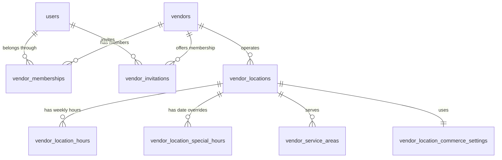

# Vendor Schema Design

**Status:** Proposed — awaiting approval  
**Target migration:** `V2__create_vendor_schema.sql`  
**Depends on:** `V1__create_identity_schema.sql`  
**Implementation status:** Not implemented

## 1. Purpose

This document proposes the relational schema for merchant organizations, their users, and their physical operating locations. It defines the vendor data required before catalog, inventory, ordering, payments, dispatch, or agent functionality is implemented.

The design supports:

- A user belonging to one or more vendors.
- A vendor having multiple physical locations.
- Vendor-scoped permissions through memberships.
- Location-specific addresses, hours, service areas, tax settings, fees, and preparation settings.
- Safe suspension and closure without deleting commerce history.
- Optimistic concurrency through version columns.

## 2. Scope

### Included in V2

- `vendors`
- `vendor_memberships`
- `vendor_invitations`
- `vendor_locations`
- `vendor_location_hours`
- `vendor_location_special_hours`
- `vendor_service_areas`
- `vendor_location_commerce_settings`

### Excluded from V2

- Products, variants, modifiers, and categories.
- Inventory records, reservations, and CSV imports.
- Carts, orders, substitutions, and delivery stops.
- Stripe Connect accounts, transfers, and settlement details.
- Announcements, offers, reviews, and support cases.
- Phase 2 POS connections and sales intelligence.

These excluded concerns will reference `vendors.id` or `vendor_locations.id` in later migrations.

## 3. Relationship Model



`vendor_memberships` is the authoritative relationship between a platform user and a vendor. A user is never granted access merely because their email domain matches a vendor.

## 4. Table Definitions

### 4.1 `vendors`

Represents the merchant organization or legal business. Location-specific operating details do not belong in this table.

| Column | Type | Null | Default | Description |
| --- | --- | --- | --- | --- |
| `id` | `UUID` | No | Application generated | Stable vendor identifier |
| `legal_name` | `VARCHAR(255)` | No | — | Registered or contractual business name |
| `display_name` | `VARCHAR(255)` | No | — | Customer-facing merchant name |
| `slug` | `VARCHAR(120)` | No | — | Human-readable URL value, not an authorization identifier |
| `description` | `TEXT` | Yes | — | Vendor-authored marketplace description |
| `support_email` | `VARCHAR(320)` | Yes | — | Vendor support contact |
| `support_phone` | `VARCHAR(32)` | Yes | — | Vendor support contact |
| `default_currency` | `CHAR(3)` | No | `'USD'` | ISO 4217 currency for new locations |
| `status` | `VARCHAR(32)` | No | `'DRAFT'` | Vendor onboarding and operating state |
| `created_by_user_id` | `UUID` | No | — | User who initiated vendor creation |
| `created_at` | `TIMESTAMPTZ` | No | `now()` | Creation time |
| `updated_at` | `TIMESTAMPTZ` | No | `now()` | Last update time |
| `version` | `BIGINT` | No | `0` | Optimistic concurrency version |

Allowed `status` values:

- `DRAFT`
- `PENDING_VERIFICATION`
- `ACTIVE`
- `SUSPENDED`
- `CLOSED`

Constraints and indexes:

- Primary key on `id`.
- Unique index on normalized `slug`.
- Foreign key `created_by_user_id -> users.id` using `ON DELETE RESTRICT`.
- Currency must match three uppercase ASCII letters.
- `display_name`, `legal_name`, and `slug` cannot be blank after trimming.
- Index on `status` for operator and onboarding queues.

### 4.2 `vendor_memberships`

Connects users to vendors and scopes their vendor permissions.

| Column | Type | Null | Default | Description |
| --- | --- | --- | --- | --- |
| `vendor_id` | `UUID` | No | — | Vendor receiving access |
| `user_id` | `UUID` | No | — | Platform user receiving access |
| `role` | `VARCHAR(32)` | No | — | Vendor-scoped permission level |
| `status` | `VARCHAR(32)` | No | `'ACTIVE'` | Membership lifecycle state |
| `invited_by_user_id` | `UUID` | Yes | — | Existing member or operator who initiated access |
| `joined_at` | `TIMESTAMPTZ` | Yes | — | Time membership became active |
| `revoked_at` | `TIMESTAMPTZ` | Yes | — | Time access was revoked |
| `created_at` | `TIMESTAMPTZ` | No | `now()` | Creation time |
| `updated_at` | `TIMESTAMPTZ` | No | `now()` | Last update time |
| `version` | `BIGINT` | No | `0` | Optimistic concurrency version |

Allowed `role` values:

- `OWNER`: full vendor control, including membership administration.
- `ADMIN`: all operational configuration except ownership transfer or vendor closure.
- `MANAGER`: location, catalog, inventory, and order operations for assigned scope.
- `STAFF`: day-to-day order and inventory operations for assigned scope.

Allowed `status` values:

- `ACTIVE`
- `SUSPENDED`
- `REVOKED`

Constraints and indexes:

- Composite primary key `(vendor_id, user_id)`.
- Foreign keys to `vendors.id` and `users.id` using `ON DELETE RESTRICT`.
- Foreign key `invited_by_user_id -> users.id` using `ON DELETE SET NULL`.
- `joined_at` is required when status is `ACTIVE`.
- `revoked_at` is required only when status is `REVOKED`.
- Index on `(user_id, status)` for authorization queries.
- Index on `(vendor_id, role, status)` for membership administration.

An active membership requires the global `user_roles` value `VENDOR_MEMBER`. Creation or activation of a membership must ensure that role exists in the same transaction. Vendor authorization still checks the membership; the global role alone never grants vendor access.

### 4.3 `vendor_invitations`

Stores invitations sent before the recipient has accepted or linked a platform account. Invitation secrets are never stored in plaintext.

| Column | Type | Null | Default | Description |
| --- | --- | --- | --- | --- |
| `id` | `UUID` | No | Application generated | Invitation identifier |
| `vendor_id` | `UUID` | No | — | Vendor offering membership |
| `email` | `VARCHAR(320)` | No | — | Normalized invited email |
| `role` | `VARCHAR(32)` | No | — | Membership role to grant |
| `token_hash` | `VARCHAR(128)` | No | — | One-way hash of the invitation token |
| `status` | `VARCHAR(32)` | No | `'PENDING'` | Invitation lifecycle state |
| `invited_by_user_id` | `UUID` | No | — | Inviting vendor member or operator |
| `accepted_by_user_id` | `UUID` | Yes | — | User that accepted the invitation |
| `expires_at` | `TIMESTAMPTZ` | No | — | Token expiry |
| `accepted_at` | `TIMESTAMPTZ` | Yes | — | Acceptance time |
| `created_at` | `TIMESTAMPTZ` | No | `now()` | Creation time |
| `updated_at` | `TIMESTAMPTZ` | No | `now()` | Last update time |

Allowed `status` values are `PENDING`, `ACCEPTED`, `EXPIRED`, and `REVOKED`.

Constraints and indexes:

- Primary key on `id` and unique constraint on `token_hash`.
- Foreign keys to vendor, inviter, and accepting user.
- Partial unique index on `(vendor_id, lower(email))` where status is `PENDING`.
- An accepted invitation requires `accepted_by_user_id` and `accepted_at`.
- Invitation acceptance creates or activates one `vendor_memberships` row transactionally.

### 4.4 `vendor_locations`

Represents one physical pickup and fulfillment location.

| Column | Type | Null | Default | Description |
| --- | --- | --- | --- | --- |
| `id` | `UUID` | No | Application generated | Stable location identifier |
| `vendor_id` | `UUID` | No | — | Owning vendor |
| `name` | `VARCHAR(255)` | No | — | Location name, such as Downtown |
| `slug` | `VARCHAR(120)` | No | — | Vendor-local human-readable identifier |
| `status` | `VARCHAR(32)` | No | `'DRAFT'` | Location lifecycle state |
| `address_line_1` | `VARCHAR(255)` | No | — | Street address |
| `address_line_2` | `VARCHAR(255)` | Yes | — | Suite, unit, or additional address |
| `locality` | `VARCHAR(120)` | No | — | City or locality |
| `administrative_area` | `VARCHAR(120)` | No | — | State, province, or region |
| `postal_code` | `VARCHAR(32)` | No | — | Postal code |
| `country_code` | `CHAR(2)` | No | `'US'` | ISO 3166-1 alpha-2 country code |
| `formatted_address` | `VARCHAR(512)` | No | — | Provider-normalized display address |
| `coordinates` | `GEOGRAPHY(POINT, 4326)` | No | — | Validated longitude and latitude |
| `timezone` | `VARCHAR(64)` | No | — | IANA timezone for hours and schedules |
| `contact_email` | `VARCHAR(320)` | Yes | — | Location-specific contact |
| `contact_phone` | `VARCHAR(32)` | Yes | — | Location-specific contact |
| `pickup_instructions` | `TEXT` | Yes | — | Instructions shown to assigned drivers |
| `created_at` | `TIMESTAMPTZ` | No | `now()` | Creation time |
| `updated_at` | `TIMESTAMPTZ` | No | `now()` | Last update time |
| `version` | `BIGINT` | No | `0` | Optimistic concurrency version |

Allowed `status` values:

- `DRAFT`
- `PENDING_VERIFICATION`
- `ACTIVE`
- `TEMPORARILY_CLOSED`
- `SUSPENDED`
- `CLOSED`

Constraints and indexes:

- Primary key on `id`.
- Foreign key `vendor_id -> vendors.id` using `ON DELETE RESTRICT`.
- Unique constraint `(vendor_id, slug)`.
- GiST index on `coordinates` for distance and zone queries.
- Index on `(vendor_id, status)`.
- Country code must contain two uppercase ASCII letters.
- Address, location name, slug, and timezone cannot be blank.

The coordinates must come from a validated geocoding result or operator-confirmed correction. They must not be silently calculated from unverified free-form text during checkout.

### 4.5 `vendor_location_hours`

Stores recurring weekly operating intervals in the location's IANA timezone. Multiple intervals per day support lunch breaks or split schedules.

| Column | Type | Null | Default | Description |
| --- | --- | --- | --- | --- |
| `id` | `UUID` | No | Application generated | Interval identifier |
| `vendor_location_id` | `UUID` | No | — | Owning location |
| `day_of_week` | `SMALLINT` | No | — | ISO day 1 Monday through 7 Sunday |
| `opens_at` | `TIME` | No | — | Local opening time |
| `closes_at` | `TIME` | No | — | Local closing time |
| `created_at` | `TIMESTAMPTZ` | No | `now()` | Creation time |
| `updated_at` | `TIMESTAMPTZ` | No | `now()` | Last update time |

Constraints and indexes:

- Primary key on `id`.
- Foreign key to `vendor_locations.id` using `ON DELETE CASCADE`.
- `day_of_week` must be between 1 and 7.
- Opening and closing times cannot be equal.
- Unique constraint `(vendor_location_id, day_of_week, opens_at, closes_at)`.
- Overlapping intervals are rejected by the service before persistence.

When `closes_at < opens_at`, the interval closes on the following local calendar day. Daylight-saving transitions are resolved using the location timezone and a documented scheduling policy.

### 4.6 `vendor_location_special_hours`

Overrides weekly hours for a specific local date.

| Column | Type | Null | Default | Description |
| --- | --- | --- | --- | --- |
| `id` | `UUID` | No | Application generated | Override identifier |
| `vendor_location_id` | `UUID` | No | — | Owning location |
| `local_date` | `DATE` | No | — | Date in the location timezone |
| `is_closed` | `BOOLEAN` | No | `FALSE` | Full-day closure flag |
| `opens_at` | `TIME` | Yes | — | Special opening time |
| `closes_at` | `TIME` | Yes | — | Special closing time |
| `reason` | `VARCHAR(255)` | Yes | — | Holiday or operational explanation |
| `created_at` | `TIMESTAMPTZ` | No | `now()` | Creation time |
| `updated_at` | `TIMESTAMPTZ` | No | `now()` | Last update time |

Constraints and indexes:

- Foreign key to `vendor_locations.id` using `ON DELETE CASCADE`.
- Unique constraint `(vendor_location_id, local_date)` for the MVP.
- Closed dates require null opening and closing times.
- Open dates require both opening and closing times and they cannot be equal.

The one-row-per-date MVP constraint means a special open date cannot contain split intervals. A child interval table can replace this limitation later if required.

### 4.7 `vendor_service_areas`

Stores delivery eligibility areas. The location remains the pickup origin; the service area determines eligible customer destinations.

| Column | Type | Null | Default | Description |
| --- | --- | --- | --- | --- |
| `id` | `UUID` | No | Application generated | Service area identifier |
| `vendor_location_id` | `UUID` | No | — | Owning location |
| `name` | `VARCHAR(120)` | No | — | Operator-facing area name |
| `area` | `GEOGRAPHY(MULTIPOLYGON, 4326)` | No | — | Eligible delivery boundary |
| `status` | `VARCHAR(32)` | No | `'ACTIVE'` | Area lifecycle state |
| `priority` | `INTEGER` | No | `0` | Precedence when areas overlap |
| `created_at` | `TIMESTAMPTZ` | No | `now()` | Creation time |
| `updated_at` | `TIMESTAMPTZ` | No | `now()` | Last update time |
| `version` | `BIGINT` | No | `0` | Optimistic concurrency version |

Constraints and indexes:

- Foreign key to `vendor_locations.id` using `ON DELETE CASCADE`.
- Allowed statuses are `ACTIVE` and `INACTIVE`.
- Unique constraint `(vendor_location_id, name)`.
- GiST index on `area`.
- Polygon validity is checked before activation.

Route duration, pickup radius, and freshness constraints are separate deterministic checkout/dispatch rules. Being inside a service polygon does not by itself guarantee delivery eligibility.

### 4.8 `vendor_location_commerce_settings`

Stores operational settings that apply to one vendor location. Mutable policy is kept separate from location identity and address data.

| Column | Type | Null | Default | Description |
| --- | --- | --- | --- | --- |
| `vendor_location_id` | `UUID` | No | — | Primary key and owning location |
| `currency` | `CHAR(3)` | No | — | Location commerce currency |
| `is_accepting_orders` | `BOOLEAN` | No | `FALSE` | Manual operational availability switch |
| `auto_accept_orders` | `BOOLEAN` | No | `FALSE` | Vendor-approved auto-accept policy switch |
| `default_preparation_minutes` | `INTEGER` | No | — | Default preparation estimate |
| `minimum_preparation_minutes` | `INTEGER` | No | — | Lower allowed estimate |
| `maximum_preparation_minutes` | `INTEGER` | No | — | Upper allowed estimate |
| `minimum_order_amount_minor` | `BIGINT` | No | `0` | Minimum base product total in minor units |
| `packaging_fee_minor` | `BIGINT` | No | `0` | Vendor-declared packaging fee in minor units |
| `tax_calculation_mode` | `VARCHAR(32)` | No | `'PROVIDER'` | Tax calculation strategy |
| `prices_include_tax` | `BOOLEAN` | No | `FALSE` | Whether vendor base prices include tax |
| `default_product_tax_code` | `VARCHAR(120)` | Yes | — | Tax-provider product classification |
| `created_at` | `TIMESTAMPTZ` | No | `now()` | Creation time |
| `updated_at` | `TIMESTAMPTZ` | No | `now()` | Last update time |
| `version` | `BIGINT` | No | `0` | Optimistic concurrency version |

Constraints:

- Primary key and foreign key on `vendor_location_id`, using `ON DELETE CASCADE`.
- Currency must match three uppercase ASCII letters.
- Preparation values must be positive and satisfy minimum <= default <= maximum.
- Monetary values must be non-negative.
- Initial MVP tax calculation mode is `PROVIDER`; other values require a later migration and approved tax design.

The platform fee `X` is not stored here. It belongs to the separately versioned platform `fee_configuration` model because vendors cannot modify it and accepted quotes must snapshot it.

## 5. Ownership and Authorization Rules

- Creating a vendor also creates an active `OWNER` membership for `created_by_user_id` in the same transaction.
- A vendor must always have at least one active owner. Removing or demoting the final owner is rejected.
- `OWNER` and `ADMIN` can invite users. Only `OWNER` can grant or revoke the `OWNER` role.
- Vendor and location access always requires an active membership plus sufficient vendor role.
- `MANAGER` and `STAFF` location restrictions are not included in the initial schema. If one vendor has users limited to specific locations, add a `vendor_membership_locations` join table before implementing authorization.
- Operators may suspend vendors or locations, but every override requires an audit record and reason.
- Agents use delegated user identity and cannot obtain broader vendor access than the acting user.

## 6. Lifecycle and Deletion Policy

- Vendors and locations use status transitions instead of hard deletion after activation.
- A `DRAFT` vendor with no dependent business records may be deleted by a privileged administrative workflow.
- Active or historical vendors use `CLOSED`; operational enforcement prevents new orders while retaining history.
- `SUSPENDED` prevents vendor access or ordering according to operator policy and records a reason in the audit system.
- Vendor membership revocation preserves the membership row and timestamps for auditability.
- Location child configuration may use cascading deletion only while the location itself is legally deletable.
- Later commerce tables use restrictive foreign keys or immutable snapshots so closing a vendor cannot erase order history.

## 7. Concurrency Rules

- Updates to `vendors`, `vendor_memberships`, `vendor_locations`, `vendor_service_areas`, and commerce settings require the expected `version`.
- Successful updates increment `version` in the same SQL statement.
- A stale version returns `409 CONCURRENT_MODIFICATION` without overwriting newer data.
- Vendor creation, initial owner membership, global role assignment, initial location, and commerce settings may be coordinated in one transaction.
- Membership and invitation commands require idempotency keys when retries could duplicate notifications or ownership changes.

## 8. Data Protection

- Vendor legal and support contact data is visible only according to role and marketplace policy.
- Invitation tokens are high-entropy, short-lived, single-use, and stored only as hashes.
- Tax registration identifiers and Stripe credentials are intentionally excluded from this schema.
- Pickup instructions are revealed to drivers only for assigned deliveries.
- Free-form descriptions and instructions are treated as untrusted content by AI agents.
- Address and service-area changes are audit logged because they affect search, checkout, and dispatch eligibility.

## 9. Planned API Mapping

The schema is intended to support these later APIs:

```text
POST   /v1/vendors
GET    /v1/vendors/{vendorId}
PATCH  /v1/vendors/{vendorId}
POST   /v1/vendors/{vendorId}/invitations
GET    /v1/vendors/{vendorId}/members
PATCH  /v1/vendors/{vendorId}/members/{userId}
POST   /v1/vendors/{vendorId}/locations
GET    /v1/vendor-locations/{locationId}
PATCH  /v1/vendor-locations/{locationId}
PUT    /v1/vendor-locations/{locationId}/hours
PUT    /v1/vendor-locations/{locationId}/special-hours/{localDate}
PUT    /v1/vendor-locations/{locationId}/service-areas
PUT    /v1/vendor-locations/{locationId}/commerce-settings
```

These are proposed contracts only. No endpoint implementation is authorized by this document.

## 10. Implementation Sequence After Approval

1. Create `V2__create_vendor_schema.sql` with the approved tables and constraints.
2. Add migration integration tests against PostgreSQL/PostGIS.
3. Add vendor domain records and JDBC repositories.
4. Implement vendor creation with transactional owner membership.
5. Implement membership and invitation authorization.
6. Implement location, hours, service area, and settings APIs.
7. Add concurrency, tenant-isolation, and lifecycle tests.
8. Build the vendor onboarding UI against the approved OpenAPI contract.

## 11. Decisions Requiring Approval

Before implementation, confirm:

1. Can one user belong to multiple vendors? Proposed answer: yes.
2. Can one vendor operate multiple locations? Proposed answer: yes.
3. Are the roles `OWNER`, `ADMIN`, `MANAGER`, and `STAFF` sufficient for MVP?
4. Must managers or staff be restricted to selected locations? Proposed answer: defer unless launch vendors require it.
5. Is one special-hours interval per date sufficient for MVP?
6. Should `packaging_fee_minor` ship in MVP, or should all vendor-defined fees be deferred?
7. Which provider calculates taxes, and what vendor tax onboarding data must be stored?
8. Should vendor legal verification status be modeled now or added with Stripe Connect onboarding?
9. Which fields may customers see before ordering: legal name, support email, support phone, or only display name?
10. What is the retention requirement for revoked memberships and expired invitations?

## 12. Approval Checklist

- [ ] Vendor and user relationship is accepted.
- [ ] Vendor and location separation is accepted.
- [ ] Membership roles and authorization rules are accepted.
- [ ] Address and PostGIS representation are accepted.
- [ ] Weekly and special-hours behavior is accepted.
- [ ] Service-area representation is accepted.
- [ ] Commerce settings and fee ownership are accepted.
- [ ] Lifecycle and deletion rules are accepted.
- [ ] Open decisions have answers or approved deferrals.
- [ ] Implementation of migration `V2` is authorized.
