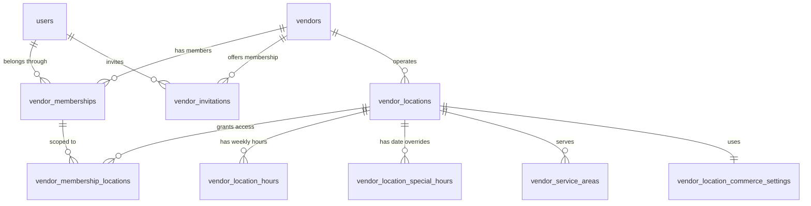

# Vendor Schema Design (V2)

**Status:** Approved & Finalized  
**Target migration:** `V2__create_vendor_schema.sql`  
**Depends on:** `V1__create_identity_schema.sql`  
**Implementation status:** Implemented in `V2__create_vendor_schema.sql`

## 1. Purpose

This document defines the relational schema for merchant organizations, their users, catalog discovery parameters, branding assets, and physical operating locations. It establishes the foundational vendor data model required before catalog, inventory, ordering, payments, dispatch, or agent functionality is implemented.

The design supports:

- A user belonging to one or more vendors.
- A vendor operating multiple physical locations.
- Vendor-scoped permissions through memberships, with optional location-level scoping for managers and staff.
- Vendor categories, tags, logo/banner media assets, and platform fee tier references.
- Location-specific addresses, PostGIS coordinates, operating hours, special date overrides, service areas, tax settings, fees, cached ratings, and preparation settings.
- Safe operational suspension and closure without deleting historical commerce transactions.
- Optimistic concurrency control through `version` columns.

## 2. Scope

### Included in V2

- `vendors` (organization identity, category, tags, branding, currency, status, fee tier)
- `vendor_memberships` (user roles and organization access)
- `vendor_membership_locations` (location-specific access scoping for staff/managers)
- `vendor_invitations` (member invitation workflows)
- `vendor_locations` (physical stores, PostGIS coordinates, contact, ratings, status)
- `vendor_location_hours` (recurring weekly operating intervals)
- `vendor_location_special_hours` (date-specific holiday/event overrides)
- `vendor_service_areas` (PostGIS delivery boundary polygons)
- `vendor_location_commerce_settings` (prep times, fees, tax calculation rules)

### Excluded from V2

- Products, variants, modifiers, and categories (V3 catalog migration).
- Inventory records, reservations, and CSV imports (V4 inventory migration).
- Carts, quotes, orders, substitutions, and delivery stops (V5 order/delivery migration).
- Stripe Connect account mappings, transfers, and ledger details (V6 payment migration).
- Announcements, offers, reviews, and support cases (V7 extension migration).
- Phase 2 POS connections and sales intelligence.

These excluded concerns reference `vendors.id` or `vendor_locations.id`.

## 3. Relationship Model

`vendor_memberships` is the authoritative relationship between a platform user and a vendor organization. `vendor_membership_locations` optionally restricts `MANAGER` or `STAFF` members to designated locations.

## 4. Table Definitions

### 4.1 `vendors`

Represents the merchant organization or legal business.

| Column | Type | Null | Default | Description |
| --- | --- | --- | --- | --- |
| `id` | `UUID` | No | Application generated | Stable vendor identifier |
| `legal_name` | `VARCHAR(255)` | No | — | Registered or contractual business name |
| `display_name` | `VARCHAR(255)` | No | — | Customer-facing merchant name |
| `slug` | `VARCHAR(120)` | No | — | Human-readable URL identifier |
| `category` | `VARCHAR(64)` | No | `'RESTAURANT'` | Primary vendor category (`RESTAURANT`, `CONVENIENCE`, `GROCERY`, `RETAIL`) |
| `tags` | `JSONB` | Yes | `'[]'::jsonb` | Array of search & discovery tags (e.g., `["Italian", "Halal"]`) |
| `logo_url` | `VARCHAR(512)` | Yes | — | Vendor logo image URL |
| `banner_url` | `VARCHAR(512)` | Yes | — | Vendor storefront hero/banner image URL |
| `description` | `TEXT` | Yes | — | Marketplace vendor description |
| `support_email` | `VARCHAR(320)` | Yes | — | Vendor support email |
| `support_phone` | `VARCHAR(32)` | Yes | — | Vendor support phone |
| `default_currency` | `CHAR(3)` | No | `'USD'` | ISO 4217 currency for new locations |
| `fee_tier_id` | `VARCHAR(64)` | Yes | — | Platform fee `X%` rule configuration reference |
| `status` | `VARCHAR(32)` | No | `'DRAFT'` | Vendor onboarding and operating state |
| `created_by_user_id` | `UUID` | No | — | User who created the vendor |
| `created_at` | `TIMESTAMPTZ` | No | `now()` | Creation time |
| `updated_at` | `TIMESTAMPTZ` | No | `now()` | Last update time |
| `version` | `BIGINT` | No | `0` | Optimistic concurrency version |

Allowed `status` values: `DRAFT`, `PENDING_VERIFICATION`, `ACTIVE`, `SUSPENDED`, `CLOSED`.

Constraints & Indexes:
- Primary key on `id`.
- Unique index on `slug`.
- Foreign key `created_by_user_id -> users.id` (`ON DELETE RESTRICT`).
- Currency must match 3 uppercase ASCII letters.
- Index on `(status, category)` for catalog search and discovery.

### 4.2 `vendor_memberships`

Connects users to vendors and scopes their permissions.

| Column | Type | Null | Default | Description |
| --- | --- | --- | --- | --- |
| `vendor_id` | `UUID` | No | — | Vendor receiving access |
| `user_id` | `UUID` | No | — | Platform user receiving access |
| `role` | `VARCHAR(32)` | No | — | Vendor permission role (`OWNER`, `ADMIN`, `MANAGER`, `STAFF`) |
| `status` | `VARCHAR(32)` | No | `'ACTIVE'` | Membership state (`ACTIVE`, `SUSPENDED`, `REVOKED`) |
| `invited_by_user_id` | `UUID` | Yes | — | User who invited member |
| `joined_at` | `TIMESTAMPTZ` | Yes | — | Time access became active |
| `revoked_at` | `TIMESTAMPTZ` | Yes | — | Time access was revoked |
| `created_at` | `TIMESTAMPTZ` | No | `now()` | Creation time |
| `updated_at` | `TIMESTAMPTZ` | No | `now()` | Last update time |
| `version` | `BIGINT` | No | `0` | Optimistic concurrency version |

Constraints & Indexes:
- Composite primary key `(vendor_id, user_id)`.
- Foreign keys to `vendors.id` and `users.id` (`ON DELETE RESTRICT`).
- Index on `(user_id, status)` for authorization queries.

### 4.3 `vendor_membership_locations`

Join table to scope `MANAGER` or `STAFF` memberships to specific physical locations.

| Column | Type | Null | Default | Description |
| --- | --- | --- | --- | --- |
| `vendor_id` | `UUID` | No | — | Vendor ID |
| `user_id` | `UUID` | No | — | User ID |
| `vendor_location_id` | `UUID` | No | — | Scoped location ID |
| `created_at` | `TIMESTAMPTZ` | No | `now()` | Creation time |

Constraints & Indexes:
- Primary key `(vendor_id, user_id, vendor_location_id)`.
- Foreign key `(vendor_id, user_id) -> vendor_memberships(vendor_id, user_id)` (`ON DELETE CASCADE`).
- Foreign key `vendor_location_id -> vendor_locations(id)` (`ON DELETE CASCADE`).

### 4.4 `vendor_invitations`

Stores pending invitations before token acceptance.

| Column | Type | Null | Default | Description |
| --- | --- | --- | --- | --- |
| `id` | `UUID` | No | Application generated | Invitation identifier |
| `vendor_id` | `UUID` | No | — | Vendor offering access |
| `email` | `VARCHAR(320)` | No | — | Invited email |
| `role` | `VARCHAR(32)` | No | — | Intended membership role |
| `token_hash` | `VARCHAR(128)` | No | — | One-way hash of invite token |
| `status` | `VARCHAR(32)` | No | `'PENDING'` | `PENDING`, `ACCEPTED`, `EXPIRED`, `REVOKED` |
| `invited_by_user_id` | `UUID` | No | — | Inviting user |
| `accepted_by_user_id` | `UUID` | Yes | — | Accepting user |
| `expires_at` | `TIMESTAMPTZ` | No | — | Expiry time |
| `accepted_at` | `TIMESTAMPTZ` | Yes | — | Acceptance time |
| `created_at` | `TIMESTAMPTZ` | No | `now()` | Creation time |
| `updated_at` | `TIMESTAMPTZ` | No | `now()` | Last update time |

### 4.5 `vendor_locations`

Represents one physical pickup and fulfillment location.

| Column | Type | Null | Default | Description |
| --- | --- | --- | --- | --- |
| `id` | `UUID` | No | Application generated | Location identifier |
| `vendor_id` | `UUID` | No | — | Owning vendor |
| `name` | `VARCHAR(255)` | No | — | Location display name (e.g. Downtown) |
| `slug` | `VARCHAR(120)` | No | — | Vendor-local URL identifier |
| `status` | `VARCHAR(32)` | No | `'DRAFT'` | `DRAFT`, `PENDING_VERIFICATION`, `ACTIVE`, `TEMPORARILY_CLOSED`, `SUSPENDED`, `CLOSED` |
| `address_line_1` | `VARCHAR(255)` | No | — | Street address |
| `address_line_2` | `VARCHAR(255)` | Yes | — | Unit/suite |
| `locality` | `VARCHAR(120)` | No | — | City |
| `administrative_area` | `VARCHAR(120)` | No | — | State/province |
| `postal_code` | `VARCHAR(32)` | No | — | Postal code |
| `country_code` | `CHAR(2)` | No | `'US'` | ISO 3166-1 alpha-2 country code |
| `formatted_address` | `VARCHAR(512)` | No | — | Geocoded display address |
| `coordinates` | `GEOGRAPHY(POINT, 4326)` | No | — | PostGIS spatial point (lon/lat) |
| `timezone` | `VARCHAR(64)` | No | — | IANA timezone (e.g. `America/Los_Angeles`) |
| `logo_url` | `VARCHAR(512)` | Yes | — | Location-specific logo override |
| `banner_url` | `VARCHAR(512)` | Yes | — | Location-specific banner override |
| `average_rating` | `NUMERIC(3,2)` | No | `0.00` | Cached customer rating (0.00–5.00) |
| `review_count` | `INTEGER` | No | `0` | Cached total review count |
| `contact_email` | `VARCHAR(320)` | Yes | — | Store contact email |
| `contact_phone` | `VARCHAR(32)` | Yes | — | Store contact phone |
| `pickup_instructions` | `TEXT` | Yes | — | Instructions for assigned drivers |
| `created_at` | `TIMESTAMPTZ` | No | `now()` | Creation time |
| `updated_at` | `TIMESTAMPTZ` | No | `now()` | Last update time |
| `version` | `BIGINT` | No | `0` | Optimistic concurrency version |

Constraints & Indexes:
- Primary key on `id`.
- Foreign key `vendor_id -> vendors.id` (`ON DELETE RESTRICT`).
- Unique `(vendor_id, slug)`.
- GiST spatial index on `coordinates`.
- Index on `(vendor_id, status)`.

### 4.6 `vendor_location_hours`

Weekly recurring operating intervals in local timezone.

| Column | Type | Null | Default | Description |
| --- | --- | --- | --- | --- |
| `id` | `UUID` | No | Application generated | Interval identifier |
| `vendor_location_id` | `UUID` | No | — | Location ID |
| `day_of_week` | `SMALLINT` | No | — | ISO day of week (1 = Monday ... 7 = Sunday) |
| `opens_at` | `TIME` | No | — | Opening time |
| `closes_at` | `TIME` | No | — | Closing time |
| `created_at` | `TIMESTAMPTZ` | No | `now()` | Creation time |
| `updated_at` | `TIMESTAMPTZ` | No | `now()` | Last update time |

Constraints:
- Foreign key to `vendor_locations.id` (`ON DELETE CASCADE`).
- `CHECK (day_of_week BETWEEN 1 AND 7)`.
- Unique constraint `(vendor_location_id, day_of_week, opens_at, closes_at)`.

### 4.7 `vendor_location_special_hours`

Date-specific holiday or event overrides.

| Column | Type | Null | Default | Description |
| --- | --- | --- | --- | --- |
| `id` | `UUID` | No | Application generated | Override ID |
| `vendor_location_id` | `UUID` | No | — | Location ID |
| `local_date` | `DATE` | No | — | Specific date in local timezone |
| `is_closed` | `BOOLEAN` | No | `FALSE` | Full-day closure flag |
| `opens_at` | `TIME` | Yes | — | Special opening time |
| `closes_at` | `TIME` | Yes | — | Special closing time |
| `reason` | `VARCHAR(255)` | Yes | — | Holiday or event reason |
| `created_at` | `TIMESTAMPTZ` | No | `now()` | Creation time |
| `updated_at` | `TIMESTAMPTZ` | No | `now()` | Last update time |

### 4.8 `vendor_service_areas`

PostGIS multi-polygon boundaries defining delivery eligibility.

| Column | Type | Null | Default | Description |
| --- | --- | --- | --- | --- |
| `id` | `UUID` | No | Application generated | Service area ID |
| `vendor_location_id` | `UUID` | No | — | Location ID |
| `name` | `VARCHAR(120)` | No | — | Area name |
| `area` | `GEOGRAPHY(MULTIPOLYGON, 4326)` | No | — | Spatial multi-polygon |
| `status` | `VARCHAR(32)` | No | `'ACTIVE'` | `ACTIVE`, `INACTIVE` |
| `priority` | `INTEGER` | No | `0` | Overlap priority |
| `created_at` | `TIMESTAMPTZ` | No | `now()` | Creation time |
| `updated_at` | `TIMESTAMPTZ` | No | `now()` | Last update time |
| `version` | `BIGINT` | No | `0` | Optimistic concurrency version |

Constraints:
- GiST spatial index on `area`.

### 4.9 `vendor_location_commerce_settings`

Location-specific operational parameters.

| Column | Type | Null | Default | Description |
| --- | --- | --- | --- | --- |
| `vendor_location_id` | `UUID` | No | — | Primary & Foreign Key |
| `currency` | `CHAR(3)` | No | — | Store currency |
| `is_accepting_orders` | `BOOLEAN` | No | `FALSE` | Manual order toggle |
| `auto_accept_orders` | `BOOLEAN` | No | `FALSE` | Policy auto-accept toggle |
| `default_preparation_minutes` | `INTEGER` | No | — | Default prep estimate |
| `minimum_preparation_minutes` | `INTEGER` | No | — | Min prep estimate |
| `maximum_preparation_minutes` | `INTEGER` | No | — | Max prep estimate |
| `minimum_order_amount_minor` | `BIGINT` | No | `0` | Min order in minor units |
| `packaging_fee_minor` | `BIGINT` | No | `0` | Packaging fee in minor units |
| `tax_calculation_mode` | `VARCHAR(32)` | No | `'PROVIDER'` | Tax calculation strategy |
| `prices_include_tax` | `BOOLEAN` | No | `FALSE` | Tax inclusion flag |
| `default_product_tax_code` | `VARCHAR(120)` | Yes | — | Tax category code |
| `created_at` | `TIMESTAMPTZ` | No | `now()` | Creation time |
| `updated_at` | `TIMESTAMPTZ` | No | `now()` | Last update time |
| `version` | `BIGINT` | No | `0` | Optimistic concurrency version |

## 5. Approval Checklist

- [x] Vendor & user multi-membership accepted.
- [x] Vendor & location separation accepted.
- [x] Vendor category, tags, and media branding URLs defined.
- [x] Location-scoped staff memberships supported via `vendor_membership_locations`.
- [x] PostGIS point coordinates & multi-polygon service areas accepted.
- [x] Weekly & special hours defined.
- [x] Commerce settings & optimistic concurrency (`version`) accepted.
- [x] Database migration script `V2__create_vendor_schema.sql` authorized.
